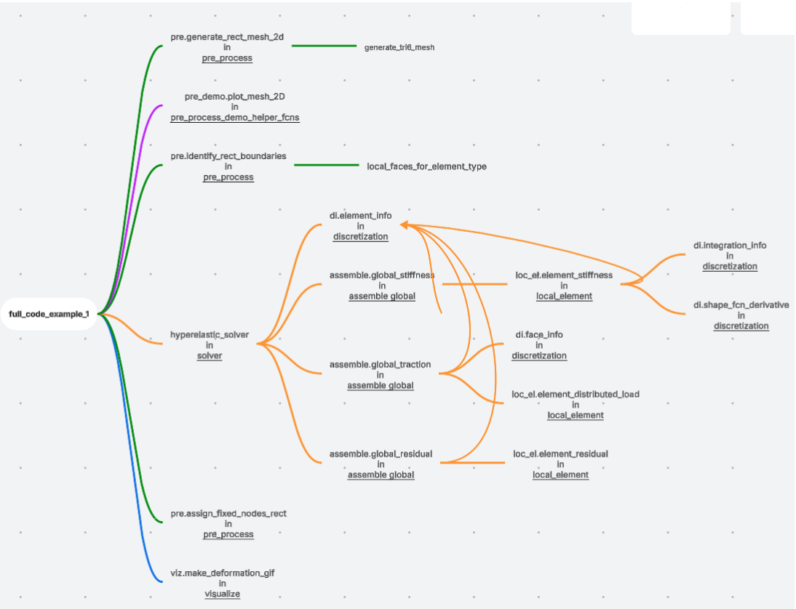

# Assignment 3

## Part 1: Code Comprehension


## Part 2A: Validation, Numerical vs. Analytical
**Result:**  
- Analytical solution for tip deflection: -0.021840  
- FEA Solution for tip deflection: -0.021817  
- Absolute error: 2.321666e-05  

## Part 2B: Implementing a Large Deformation with h-refinement & p-refinement
**Result:**  
=== Tip Deflection Comparison ===  
- Analytical Euler-Bernoulli deflection: -4.422600  
- **Original:**  
  - Computed tip deflection (y): -3.503802  
  - Absolute error: 9.187982e-01  
- **H-Refinement:**  
  - Computed tip deflection (y): -4.119528  
  - Absolute error: 3.030724e-01  
- **P-Refinement:**  
  - Computed tip deflection (y): -4.370599  
  - Absolute error: 5.200065e-02  

## Part 2C: Implementing a Large Deformation where the FEA code fails
**Reason for failure:** Large loading and low stiffness  

# finite-element-analysis

[](https://www.python.org/)

[](https://github.com/sandialabs/sibl#license)

[](https://codecov.io/gh/Lejeune-Lab-Graduate-Course-Materials/finite-element-analysis)
[](https://github.com/Lejeune-Lab-Graduate-Course-Materials/finite-element-analysis/actions)


### Conda environment, install, and testing

Note: this is an extremely minimalist readme, but the code is highly documented and will get built out over the coures of assignment 3.

```bash
conda create --name finite-element-analysis-env python=3.12.9
```

```bash
conda activate finite-element-analysis-env
```

```bash
python --version
```

```bash
pip install --upgrade pip setuptools wheel
```

```bash
pip install -e .
```

```bash
pytest -v --cov=finiteelementanalysis --cov-report term-missing
```


The stuff that you have to add, i will tell you
